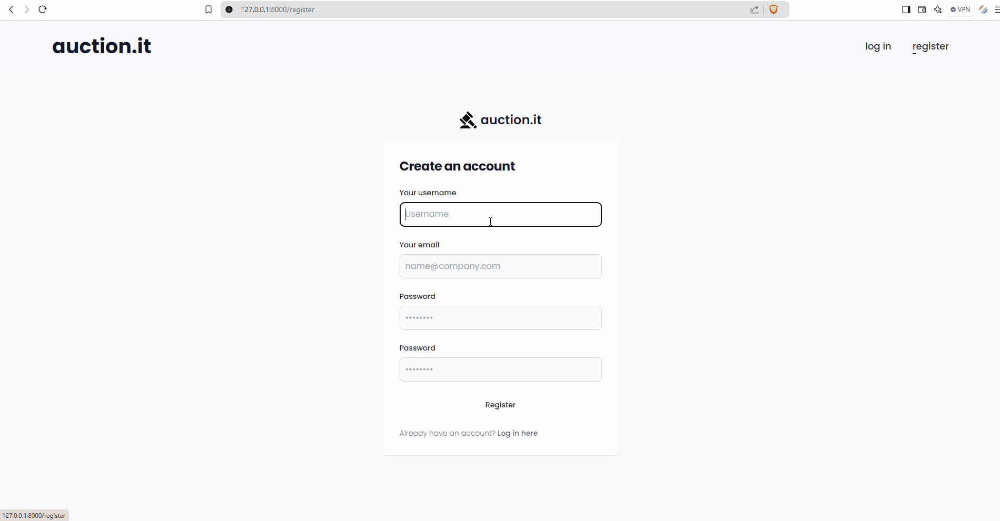

<div style="background: #F1F5F9;" align="center"><br>


<h3 align="center">Auction It!</h3><br>
</div>


  A dynamic e-commerce auction site that allows users to post auction listings, place bids on listings, comment on those listings, and add listings to a "watchlist." It's designed to provide a comprehensive online auction experience.

## Table of Contents 
- [Table of Contents](#table-of-contents)
- [Installation](#installation)
- [Features](#features)
- [Roadmap](#roadmap)
- [Technologies](#technologies)
- [Project Structure](#project-structure)
- [License](#license)
- [Acknowledgments](#acknowledgments)


## Installation

To set up this project on your computer:

1. Clone this project
    ```
    git clone https://github.com/httpvieve/auction-it.git
    ```
2. Install all necessary dependencies
    ```
    pip install -r requirements.txt
    ```
3. Open commerce folder
    ```
    cd commerce
    ```
4. Make migrations then migrate
    ```
    python manage.py makemigrations
    ```
    ```
    python manage.py migrate
    ```
5. Run the development server
    ```
   python manage.py runserver
    ```

## Features

**User account creation and management**




----- 
**Active Listings**: The home page showcases all current active auctions, allowing buyers to browse available items.
**Listing Details**: Users can view comprehensive information about each listing, including the current highest bid and bidding history.


-----


**Watchlist**: Users can curate a personal watchlist, adding interesting items for easy tracking and access.
**Bidding**: Registered users can place bids on active listings, competing to win the desired items.


-----

**Create Listing**: Sellers can create new auction listings, providing details such as title, description, starting bid, and optional image URL and category.


-----

**Categories**: Items are organized into categories, facilitating efficient browsing and discovery.


-----

**Comments**: The platform supports user interaction through a commenting system on listing pages.


-----

**Admin Interface**: Site administrators have access to a powerful backend interface for managing listings, bids, and user comments.


## Roadmap


- [x] User authentication
- [x] Create listing functionality
- [x] Active listings page
- [x] Individual listing pages
- [x]  Bidding system
- [x]  Watchlist functionality
- [x]  Commenting system
- [x]  Categories
- [x]  Django Admin Interface
- [ ] User profile pages
- [ ] Search functionality
- [ ] Payment integration
  

## Technologies
- [Django(Python)](https://www.djangoproject.com/)
- [TailwindCSS](https://tailwindcss.com/)
- [SQLite](https://www.sqlite.org/)

## Project Structure
```

    commerce/
    │
    ├── commerce/                 # Project configuration folder
    │   ├── __init__.py
    │   ├── asgi.py
    │   ├── settings.py             # Project settings
    │   ├── urls.py                 # Project URL configuration
    │   └── wsgi.py
    │
    ├── auctions/                   # Main application folder
    │   ├── migrations/             # Database migrations
    │   ├── static/                 # Static files (CSS, images)
    │   │   └── auctions/
    │   │       ├── styles.css
    │   │       └── images/
    │   ├── templates/              # HTML templates
    │   │   └── auctions/
    │   │       ├── index.html
    │   │       ├── layout.html
    │   │       └── ...
    │   ├── __init__.py
    │   ├── admin.py                # Admin interface configuration
    │   ├── apps.py
    │   ├── models.py               # Database models
    │   ├── urls.py                 # App URL configuration
    │   └── views.py                # View functions
    │
    ├── manage.py                   # Django's command-line utility
    └──  requirements.txt            # Project dependencies

```
## License

Distributed under the MIT License. See [MIT License](https://opensource.org/licenses/MIT) for more information.
## Acknowledgments

- [Django Documentation](https://docs.djangoproject.com/en/5.1/)
- [CS50’s Web Programming with Python and JavaScript](https://cs50.harvard.edu/web/2020/)
